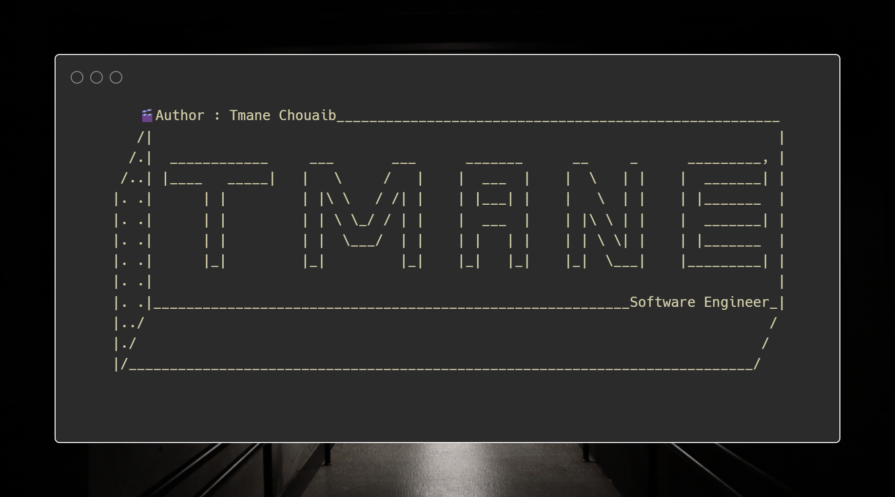

<h2 align="center">   
REST API DEMO
</h2>

## 🔎 Table of Contents:

- [About](#about)
- [Objective](#objective)
- [Technical features](#technical-features)
- [Endpoints](#endpoints)
- [HTTP Status Codes](#http-status-codes)
- [Project Structure](#project-structure)
- [Used Technologies](#used-technologies)
- [Contacts](#contacts)

## <a name="about"></a> 📎 About:

- This repository provides a foundational Spring Boot application demonstrating the implementation of a RESTful API.

## <a name="objective"></a> 📎 Objective:

- The main objective of this repository is to provide a demonstration of building a RESTful API using Spring Boot.

## <a name="technical-features"></a> 📎 Technical Features:

- This project showcases the following technical features:

| Feature                  | Description                                                                                                                 |
|--------------------------|-----------------------------------------------------------------------------------------------------------------------------|
| **Project Structure**    | Organized project structure following best practices and conventions to enhance code readability and maintainability.       |
| **DTOs**                 | Usage of DTOs to encapsulate data exchanged between the client and server.                                                  |
| **Mapper Classes**       | Mapper classes for mapping between DTOs and entities, promoting clean separation of concerns and enhancing maintainability. |
| **Repository Layer**     | Data access logic managed by JPA repositories, leveraging Spring Data JPA for seamless database interactions.               |
| **Service Layer**        | Business logic encapsulated in service classes to maintain separation of concerns and enhance modularity.                   |
| **RESTful Endpoints**    | Implementation of CRUD operations following RESTful conventions for managing resources.                                     |
| **Exception Handling**   | Custom exception handling for gracefully managing errors and providing meaningful responses to clients.                     |
| **Swagger OpenAPI**      | Integration with Swagger for API documentation, enhancing API discoverability and ease of use.                              |
| **CORS Configuration**   | Configuration to allow requests from specified origins, facilitating cross-origin communication.                            |
| **Database Interaction** | Interaction with MySQL database using Hibernate as the JPA implementation, ensuring efficient data storage and retrieval.   |

## <a name="endpoints"></a> 📎 Endpoints:

### RESTful Endpoints naming convention:

- RESTful convention :

| Endpoint      | HTTP Method | Description                                    |
|---------------|-------------|------------------------------------------------|
| {entity}      | GET         | Retrieves the complete list of entities.       |
| {entity}      | POST        | Create a new entity.                           |
| {entity}/{id} | GET         | Retrieves the details of a specific entity.    |
| {entity}/{id} | PUT         | Updates the information of an existing entity. |
| {entity}/{id} | DELETE      | Delete an existing entity.                     | 

- After launching the application, you can access the Swagger
  documentation [here](<http://localhost:8080/swagger-ui/index.html>).
- Alternatively, you can simply refer to the table below, which displays the available endpoints.

**Personages API Endpoints**

| Endpoint        | HTTP Method | Description                                       |
|-----------------|-------------|---------------------------------------------------|
| personages      | GET         | Retrieves the complete list of personages.        |
| personages      | POST        | Create a new personage.                           |
| personages/{id} | GET         | Retrieves the details of a specific personage.    |
| personages/{id} | PUT         | Updates the information of an existing personage. |
| personages/{id} | DELETE      | Delete an existing personage                      |

## <a name="http-status-codes"></a> 📎 Http Status Codes:

- This section presents the most commonly encountered HTTP status codes when developing a REST API.HTTP status codes are
  crucial indicators of the request and response state between the client and the server.
  Here are the top ten HTTP status codes and their meanings in the context of RESTful web services.

#### Top 10 HTTP Status Codes

| Code | Description           | REST Service-Specific Information                                                         |
|------|-----------------------|-------------------------------------------------------------------------------------------|
| 200  | OK                    | The request has been successfully processed.                                              |
| 201  | Created               | The request has been successfully processed, and a new resource has been created.         |
| 204  | No Content            | The request has been successfully processed but does not return any content.              |
| 304  | Not Modified          | The resource has not been modified since the last request.                                |
| 400  | Bad Request           | The request is malformed or cannot be processed by the server.                            |
| 401  | Unauthorized          | Access to the resource requires authentication.                                           |
| 403  | Forbidden             | Access to the resource is forbidden for the current user.                                 |
| 404  | Not Found             | The requested resource was not found on the server.                                       |
| 409  | Conflict              | The request cannot be processed due to a conflict with the current state of the resource. |
| 500  | Internal Server Error | An internal server error occurred, preventing the request from being processed.           |

#### note:

- This table of HTTP status codes is essential for understanding the responses returned by REST API and for diagnosing
  potential issues during the development or integration of an application with the API.

## <a name="project-structure"></a> 📎 Project Structure:

```
spring-boot-rest-api-demo/
│
├── src/
│   ├── main/
│   │   ├── java/
│   │   │   └── com/
│   │   │       └── tmane/
│   │   │           └── restappdemo/
│   │   │               ├── config/
│   │   │               │   └── WebConfig.java
│   │   │               ├── controller/
│   │   │               │   └── PersonnageController.java
│   │   │               ├── dto/
│   │   │               │   └── PersonnageDTO.java
│   │   │               ├── entity/
│   │   │               │   └── Personnage.java
│   │   │               ├── exception/
│   │   │               │   └── PersonnageNoSuchElementException.java
│   │   │               ├── handler/
│   │   │               │   └── GlobalExceptionHandler.java
│   │   │               ├── mapper/
│   │   │               │   └── PersonnageMapper.java
│   │   │               ├── repository/
│   │   │               │   └── PersonnageRepository.java
│   │   │               ├── service/
│   │   │               │   ├── Impl/
│   │   │               │   │   └── PersonnageServiceImpl.java
│   │   │               │   └── PersonnageService.java
│   │   │               └── RestAppDemoApplication.java
│   │   │
│   └── resources/
│       ├── application.properties
│       └── messages.properties
├── pom.xml
└── README.md
```

## <a name="used-technologies"></a> 📎 Used technologies:

#### This project is built using the following technologies:

- Spring Boot
- Spring Data JPA
- Spring Data REST
- Swagger OpenAPI
- MySQL Database

## <a name="contacts"></a> 📎 Contacts:

- For any inquires or feedback regarding this project, please contact me on: chouaib.tmane@hotmail.com.

<p align="right" style="font-size: x-large; font-weight: bold"> End </p>

----------------------------------------------------------------------------------------------------------

<p align="end">

